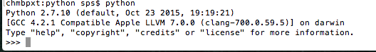
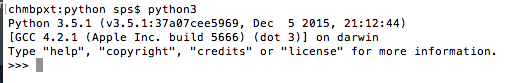
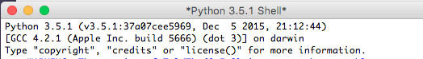
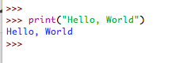
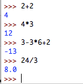

# SPS Python Course


## Contents

<!-- TOC depthFrom:1 depthTo:6 withLinks:1 updateOnSave:1 orderedList:0 -->

- [SPS Python Course](#sps-python-course)
	- [Contents](#contents)
	- [Running Python](#running-python)
		- [Finding help](#finding-help)
			- [The official help](#the-official-help)
			- [Guide to reading the official help](#guide-to-reading-the-official-help)
			- [Search for it](#search-for-it)
		- [Installing and Running Python](#installing-and-running-python)
			- [Windows](#windows)
			- [Mac](#mac)
			- [Linux](#linux)
			- [Running Online](#running-online)
	- [IDLE and The Command Line](#idle-and-the-command-line)
		- [Hello, World](#hello-world)
	- [Variables, Data Types and simple input/output](#variables-data-types-and-simple-inputoutput)
	- [User Interface using Turtles](#user-interface-using-turtles)
	- [Simple functions](#simple-functions)
	- [Conditional statements](#conditional-statements)
	- [Chatterbox Functions](#chatterbox-functions)
	- [Iteration](#iteration)
	- [Further Reading](#further-reading)
		- [Acknowledgements](#acknowledgements)

<!-- /TOC -->


## Running Python

We use Python version 3. You might find Python version 2 installed on your own machine. If you only have v2 much of what you write will be fine but some of the examples written here might not work but, more importantly, quite a bit of v2 code will not run on v3.

### Finding help

There are four steps to enlightenment

1. Think about it - read your notes or your old code
1. Ask a friend - the act of asking a question is often helpful to thinking of an answer
1. Google it - reading other people's answers can certainly be helpful
1. Ask a teacher - this should only be step 4

#### The official help

The [official documentation](https://docs.python.org/3/) on the Python website will often confound as often as it will assist, but if in doubt go here first. This will explain what the language expects and it outlines in great detail everything about the built-in functions

#### Guide to reading the official help

1. Read it
	* if you understand it, great
	* if not,
1. Read it again
	* it probably still makes no sense but you have tried

#### Search for it

If you go to [Google](https://www.google.com/) (other search engines are available), make sure you include the word `python`. If you do that, you will almost certainly end up with a link to either the official documentation or to the site [Stack Overflow](http://stackoverflow.com/) which is one of the most excellent sites on the whole web.

There is much in [Stack Overflow](http://stackoverflow.com/questions/tagged/python) that is very helpful, but do not just copy and paste it.

1. Search for your question
1. Find a question that looks like it has a reasonable answer
1. Read the answer - not just the code snippet, but the answer to the question, and maybe other answers
	* it will almost certainly be far more detailed than you understand
	* but if you read it and try to understand, you will learn something
1. By all means then copy the code
1. Put the snippet into your code with a comment
	* include a link back to stack overflow (or wherever) both for your own use, but also when you submit your answer, it shows that you've tried looking
	* highlight how the code works

**You should not just be writing code that works. You should be writing code that you understand.**


### Installing and Running Python

The instructions for installing on your own machine will depend on which operating system you are running. In general for all systems go to the [official download pages](https://www.python.org/downloads/) and it will hold your hand from there.

#### Windows

Windows-R and search for `IDLE` should bring up the IDE.

#### Mac

Python will almost certainly already be installed. At a terminal window, simply type `python` and you should be met with:



If, instead, you type `python3` you should receive something like this:




In the Application



#### Linux

You're _l33t_ already. Google it, ninja.

#### Running Online

## IDLE and The Command Line

Python is an _interpreted_ language, this means that the code you write is read by the computer line-by-line and dealt with there and then. Many languages are _compiled_, this is when your code is translated into a computer-readable form and stored in a separate file, e.g. an app file or an .EXE which can then be run many times on its own, without the compiler.

What this means is that you can type lines straight into the **command line** (sometimes known as the shell) or save them into a text file and have Python run them.

We will be using Python's program called **IDLE** - its **I**ntegrated **D**eve**L**opment **E**nvironment. **IDLE** allows us to use the command line or to run files of Python.

When you run IDLE you are given a command line which is indicated by three greater than symbols:

```
>>>
```

You can always type any Python command here. Importantly, you will be able to call your own code from here.

### Hello, World

The classic program to start is to have the program print the words 'Hello, World'. At the command line:

```
>>> print("Hello, World")
```

You should see something like this:



There's a lot going on here, let's unpack it:

* `print` is the Python instruction to output some text to the screen.
	* Normal text is written in black, you'll noticed that print is slightly differently coloured to show it is special, a **keyword**
* the round brackets that come after the `print` are there to hold what it is that we want to print
* the text we want to print are held in quotation marks, this shows that we are dealing with some text, not Python instructions
* then we've hit enter and, in blue, the output is shown

We could use Python as a calculator.



These are numbers, not text, so Python doesn't need to wrap them in quotation marks. 

## Variables, Data Types and simple input/output
## User Interface using Turtles

## Simple functions

```python
import turtle

def draw_square(t, sz):
 """Make turtle t draw a square of sz."""
 for i in range(4):
     t.forward(sz)
     t.left(90)


wn = turtle.Screen()        # Set up the window and its attributes
wn.bgcolor("lightgreen")
wn.title("Alex meets a function")

alex = turtle.Turtle()      # Create alex
draw_square(alex, 50)       # Call the function to draw the square
wn.mainloop()
```

## Conditional statements
## Chatterbox Functions
## Iteration

## Further Reading

### Acknowledgements

This course is heavily influenced by various introductory texts, e.g.
[How to Think Like a Computer Scientist](http://openbookproject.net/thinkcs/python/english3e/) and the slightly scarily named [Learn Python The Hard Way](https://learnpythonthehardway.org/book/).
Many of the exercises are very different.
